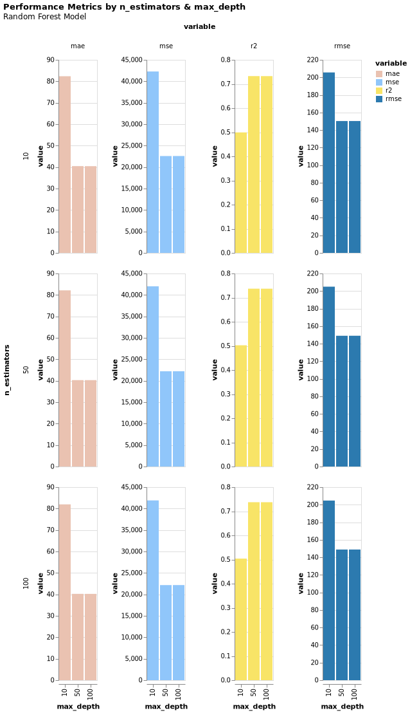
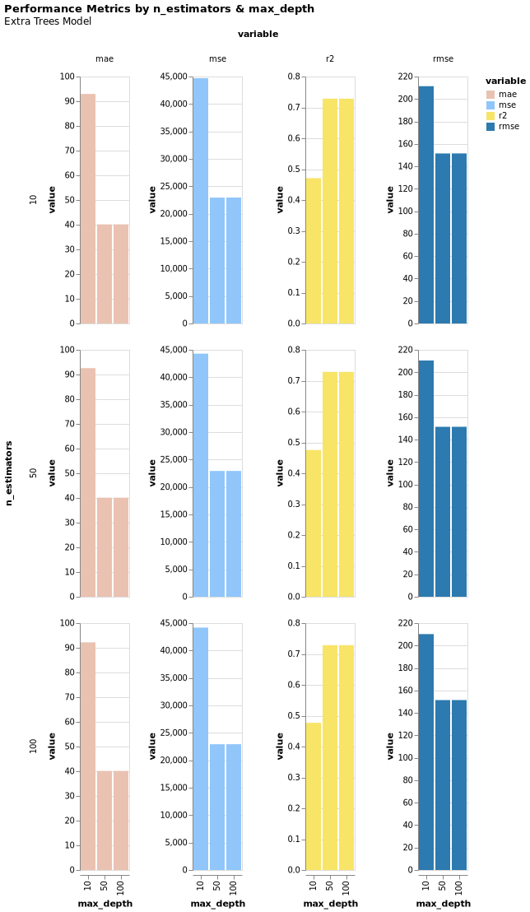
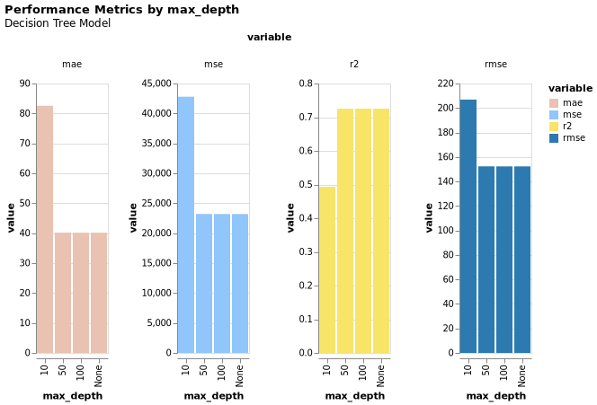
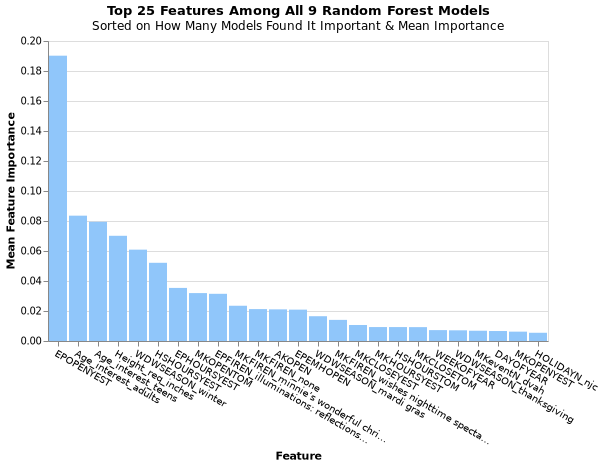
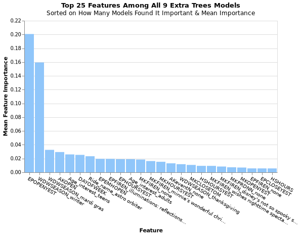
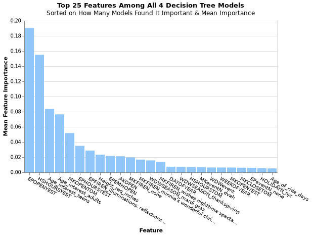

# Once Upon a Wait Time: Modeling Disney World Ride Wait Times with Machine Learning


Contributors: [Zealand Cooley](https://github.com/zealandcooley2), [Kendall Dyke](https://github.com/kendalldyke14), & [Zhou Wang](https://github.com/ZhouWangUMich)

## Project Overview

This project builds and trains a regression model to predict the posted wait times for 20 rides in Walt Disney World's Magic Kingdom. We also focus on determining which features are most important to the model and therefore may influence wait times at Magic Kingdom.

## Data Sources

### Disney World Wait Time Data & Park Information

We gathered our wait time data for each ride and the respective park day metadata (Open/Close times, parades, shows, fireworks, capacity, etc.) from [TouringPlans](https://touringplans.com/walt-disney-world/crowd-calendar#DataSets) who has kindly made this information available for academic projects.

We gathered additional metadata about each ride specifically from Lynne Passanisi on [data.world](https://data.world/lynne588/walt-disney-world-ride-data). A few fields like *age of the ride* were out of date. We overcame this limitation by dynamically calculating the age of the ride on each day when appending to our wait time dataset so that we had the accurate age of the ride on that given day in the park.

### Covid-19 Data

We utilized the [CDC data](https://data.cdc.gov/Case-Surveillance/United-States-COVID-19-Cases-and-Deaths-by-State-o/9mfq-cb36/data) for number of new cases on that given day across all 50 states to act as a proxy to the national Covid-19 situation on that day in the parks. We were curious to learn if heightened Covid-19 promenance would have any impact on the wait times in the parks.

### Weather Information
Our main source for weather data comes from the USA government agency, the National Centers for Environmental Information (NCEI), in the form of their [Integrated Surface Dataset](https://www.ncei.noaa.gov/access/search/data-search/global-hourly?bbox=28.675,-81.514,28.401,-81.240). This dataset contains a variety of useful information such as wind conditions, sky conditions, visibility, temperature, and percipitation. One of the things to note is that all the data originates from the Orlando Internation Airport, where the weather measuring equipment was located. We decided that this location was geographically close enough to Walt Disney World that the weather patterns should translate fairly closely (approximately 16 miles away). Furthermore, within the geographical constraint that we set (City of Orlando, Florida), this was the only waypoint located from which data could be sourced.

This dataset can be fairly nondescript in its naming scheme and formatting so we used the [formatting document](https://www.ncei.noaa.gov/data/global-hourly/doc/isd-format-document.pdf) and dictionary mapping to convert these values to more human-legible ones. Some of the more interesting tidbits of information that we had hoped to contribute to ride times were wind conditions, sky conditions, temperature, and percipitation. An assumption that we held was that inclement weather would be a large deterrent for people going on rides and would lower the wait times for those rides. What we found during our modeling phase was that this was not the case. In fact, weather conditions like rain did not rank highly in terms of feature importance and were not significant at all. Looking at the dataset for the weather information, we find that only approximately 250 entries of the 12500 entries had rain. This represents 2% of the data, which when we passed through the variance threshold, was dropped from the dataset. Stepping back from the mathematical perspective of the data, there is an element that we also need to consider. People don't want to get on rides during bad weather and it may even be shut down during heavy storms, thus decreasing their relevance to the ride wait times.

### Exploratory Data Analysis

Once all the data was collected, we also spent some time in creating a Pandas Profiling Report using the ```pandas-profiling``` library. This library expands on the basic ```df.describe()``` feature of pandas to display more information for quick data analysis. Through this tool, we can quickly learn at a glance which variables are correlated with each other and which ones we could easily discard due to some columns containing only a constant. 

What we found through this was that there was high correlation scores amongst many of the variables. A lot of these relations make sense, such as ```Temperature (C)``` and ```WEEKOFYEAR (Week of the year)```. Unfortunately, due the high number of features and correlation between so many of them, it becomes too hard to visually discern which ones we need to drop so we will proceed with identifying which features should be dropped at this step.


## Ride Wait Time Regression Model

### Modeling Overview

We explored several advanced regression models in the sklearn package and learned that tree-based models tend to do well on our data. From here, we more deeply explored three main tree based regressors: ```RandomForestRegressor```, ```DecisionTreeRegressor``` & ```ExtraTreesRegressor```. While these models generally did very similarly, we ultimately chose the ```RandomForestRegressor``` because it did just a little bit better than the other two with similar model complexities. 

Further, we found that we could reduce the complexity of our model to a ```max_depth``` of 50 with only about 10 trees (tuned by the ```n_estimators``` parameter) with very minimal impact to model performance.

| Random Forest Model Results  | Extra Trees Model Results | Decision Tree Model Results
:-------------------------:|:-------------------------:|:-------------------------:
 | |

### Model Requirements

All of the package requirements for our model & associated notebooks can be found in our requirements.txt file. These requirements will be installed when running the Makefile or by running the following line in your terminal:
```
pip install -r requirements.txt
```

### Model Exploration via Jupyter Notebook

You can interact with our model & sklearn pipeline independently in [notebooks/RegressionPipelineAndResults.ipynb](https://github.com/DisneyWorldWaitTimes/WaitTimeExplorationAndPrediction/blob/main/notebooks/RegressionPipelineAndResults.ipynb)

### End-to-End Pipeline (Makefile)

We have also developed a [Makefile](https://github.com/DisneyWorldWaitTimes/WaitTimeExplorationAndPrediction/blob/main/Makefile) pipeline that will run with command ```make``` in your CLI. This Makefile will take the raw data all the way through the cleaning, feature engineering, training & prediction steps. Upon completion, it will print a dictionary in the following format to show how the model did against the test dataset.

```
{'Mean Absolute Error (MAE)': 40.45313127097203, 'Mean Squared Error (MSE)': 22577.2899065588, 'R-Squared': 0.7326651661948325}
```

Each Python script for the steps in the Makefile can be found in [src/](https://github.com/DisneyWorldWaitTimes/WaitTimeExplorationAndPrediction/tree/main/src)
* [```data_cleaning.py```](src/data/data_cleaning.py) : Aggregates the data from each source & writes combined data files with initial data cleaning efforts to CSV
* [```feature_engineering.py```](src/models/feature_engineering.py) : Takes in the results of ```data_cleaning.py```, parses datetime information to integer features, and sorts data in preparation for imputation in the sklearn pipeline
* [```pipeline_train.py```](src/models/pipeline_train.py) : Takes results of ```feature_engineering.py``` and completes, data imputation, key event hour parsing from HH:MM to integer hour (hour of parades, shows, open times, close times, etc.), trains model on training dataset, and writes resulting pipeline to Pickle file
* [```pipeline_predict.py```](src/models/pipeline_predict.py) : This takes in the Pickle sklearn pipeline created in ```pipeline_train.py``` and applies it to the test dataset. This results in a dictionary with test metrics for the resulting model

### Adding More Rides Into Scope

**To add a new ride into the pipeline:** 
1. Add the respective CSV file from TouringPlans to [data/raw](https://github.com/DisneyWorldWaitTimes/WaitTimeExplorationAndPrediction/tree/main/data/raw)
2. Add the file name to ```ride_files``` list in [helper.py](https://github.com/DisneyWorldWaitTimes/WaitTimeExplorationAndPrediction/blob/main/src/data/helper.py)
3. Add the ride name to ```ride_names``` in the same file as step 2
4. Re-run the [Makefile](https://github.com/DisneyWorldWaitTimes/WaitTimeExplorationAndPrediction/blob/main/Makefile) to re-train the model with the new ride in scope

## Our Results

### Final Metrics
Our final chosen model has an R-squared value of ~0.73 which was a large improvement over the baseline dummy regressors which had r-squared values of nearly 0. Even other non-tree based models were mostly not getting much higher than 0.5 for R-squared. We were also able to reduce our Mean Absolute Error by 75% and Mean Squared Error by 73% over a dummy regressor with ```mean``` prediction strategy.

### Feature Importance

One of our main goals with this project was to explore feature importance to determine what is really behind the *magic* of a Disney day. As discussed, our 3 tree-based models performed very similarly, so we also explored feature importance across several trained models of each type with differing hyperparameters for each run. We sorted the top features for each model on number of models that found that feature important and mean importance among those models. Our results are as follows for each main type of tree-based model that we explored:

| Random Forest Feature Importance  | Extra Trees Feature Importance  | Decision Tree Feature Importance 
:-------------------------:|:-------------------------:|:-------------------------:
 |  |


## Next Steps for Future Developers

As we were limited to an 8 week capstone course for this project, we could not possibly complete all of our machine learning dreams during this time. We want to share some of these goals with the community for anyone looking to build on our work:

* Build a user-facing model for predicted wait times.
  * This would likely require a live weather API for daily Magic Kingdom weather, an unsupervised learning model to predict capacity on the current day, and live data about the park hours, events, etc. (which could likely be scraped from the Disney website).
* Does Disney inflate wait times? Build a user-facing model for actual wait times and compare with predicted wait times.
* Additional feature selection & tuning to improve upon current model 
* Individual models for each ride may help improve model performance.
